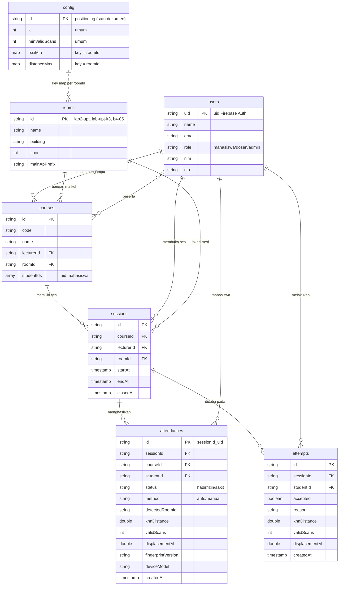

# ERD Firestore

```mermaid
erDiagram
  users ||--o{ courses : "dosen pengampu"
  courses }o--o{ users : "peserta"
  rooms ||--o{ courses : "ruangan matkul"
  courses ||--o{ sessions : "memiliki sesi"
  users ||--o{ sessions : "membuka sesi"
  rooms ||--o{ sessions : "lokasi sesi"
  sessions ||--o{ attendances : "menghasilkan"
  users ||--o{ attendances : "mahasiswa"
  sessions ||--o{ attempts : "dicoba pada"
  users ||--o{ attempts : "melakukan"
  config ||..o{ rooms : "key map per roomId"
  users {
    string uid PK "uid Firebase Auth"
    string name
    string email
    string role "mahasiswa/dosen/admin"
    string nim
    string nip
  }
  rooms {
    string id PK "lab2-upt, lab-upt-lt3, b4-05"
    string name
    string building
    int floor
    string mainApPrefix
  }
  courses {
    string id PK
    string code
    string name
    string lecturerId FK
    string roomId FK
    array studentIds "uid mahasiswa"
  }
  sessions {
    string id PK
    string courseId FK
    string lecturerId FK
    string roomId FK
    timestamp startAt
    timestamp endAt
    timestamp closedAt
  }
  attendances {
    string id PK "sessionId_uid"
    string sessionId FK
    string courseId FK
    string studentId FK
    string status "hadir/izin/sakit"
    string method "auto/manual"
    string detectedRoomId
    double knnDistance
    int validScans
    double displacementM
    string fingerprintVersion
    string deviceModel
    timestamp createdAt
  }
  attempts {
    string id PK
    string sessionId FK
    string studentId FK
    boolean accepted
    string reason
    double knnDistance
    int validScans
    double displacementM
    timestamp createdAt
  }
  config {
    string id PK "positioning (satu dokumen)"
    int k "umum"
    int minValidScans "umum"
    map rssiMin "key = roomId"
    map distanceMax "key = roomId"
  }
```
